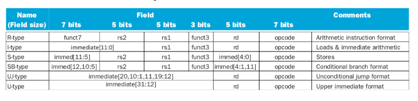
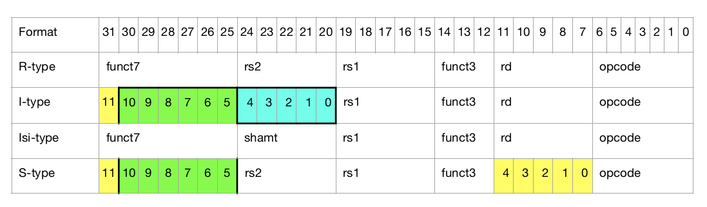

# Info

### Instructions Formats Risc-V

- R-type: arithmetic operation
- I-type: immediately data operation
- S-type: store operation
- SB-type: conditional jump operation
- U-type: immediately big data operation
- UJ-type: unconditional jump operation

### Important terms

- opcode: identify instruction
- rd: register destiny operator (result)
- funct3: opcode assistant 3 bits
- rs1: first register operating from origen
- rs2: second register operating from origen
- funct7: opcode assistant 7 bits
- RI: instruction Register (store the instruction)
- shamt: bits displacement
- immed: how many bits displace

### Hexa -> Binary
- Each 4 bits = 1 hex code
- exemple: 0111 -> 0x7 (decimal: 7)
- exemple2: 1111 -> 0xf (decimal: 15)
- exemple3: 0111 1111 -> 0x7f (decimal: 127)

#### In C programming language
We can use operator '&' to use "AND" operation and transform hexadecimal values to binary
Here some example:

- First let´s take one instruction in hexadecimal from rars. In this case: 0x00f40313 (I-type addi). Each number of this hexadecimal value represents 4 bits.
- We can filter our hexadecimal value considering what we want.
- Opcode, responsible for identifying instructions, is always 7 bits. For that, we can use operator "&" with our hexadecimal value and a mask "0x7F".
- 0x7f was chosen because it represents 0111 0000. In our case, we are treating 32 bits variables, our mask is 0000 0000 0000 0000 0000 0000 0111 1111. 
- 0 & anything = 0
- 1 & anything = 1

#### Traveling through bits
- We can use ">>" operator to travel to our´s bits, adding zeros to the left
- Then we can use a mask to "look" only at the digits we want, making sure all the others are equal to zero by "& 0".

### Risc-V Formats
#### Using Risc-V, instructions have 32 bits of length divided between the fields:
- funct7
- rs2
- rs1
- funct3
- rd
- opcode

- Some examples:

### Goal

- Print for each instruction the following values

