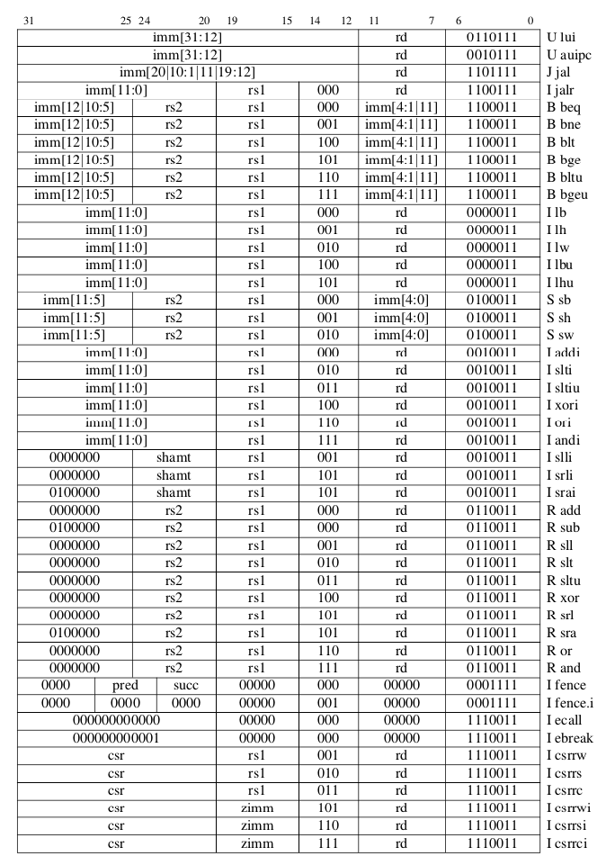

# Info

### Instructions Formats Risc-V

- R-type: arithmetic operation
- I-type: immediately data operation
- S-type: store operation
- SB-type: conditional jump operation
- U-type: immediately big data operation
- UJ-type: unconditional jump operation

### Important terms

- opcode: identify instruction
- rd: register destiny operator (result)
- funct3: opcode assistant 3 bits
- rs1: first register operating from origen
- rs2: second register operating from origen
- funct7: opcode assistant 7 bits
- RI: instruction Register (store the instruction)
- shamt: bits displacement
- immed: how many bits displace

### Risc-V Formats
#### Using Risc-V, instructions have 32 bits of length divided between the fields:
- funct7
- rs2
- rs1
- funct3
- rd
- opcode

- Some examples:

### Goal

- Print for each instruction the following values

