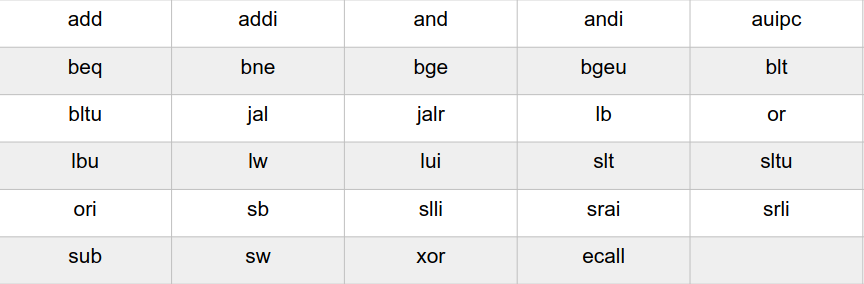

# Info

### Goal

Build a Simulator of RiscV architecture in c programming language.
- Basic functions of search and decode are given.
- Build execute function of the following functions:

### Flashback...

- opcode: identify instruction (primarily);
- rs1: first register we are working with;
- rs2: second register we are working with;
- rd: destiny register, where we store the result of instruction;
- funct3: helps identify instruction;
- funct7: also helps identify instruction.

### In C programming language;

- Our memory will be simulated by an int_32 array, simulating ours registers in the processor.
- We will try to identify the instruction via opcode;
- If opcode is not enough to identify given instruction, we will use funct3;
- Else if opcode and funct3 aren´t enough, then we will use funct7;
